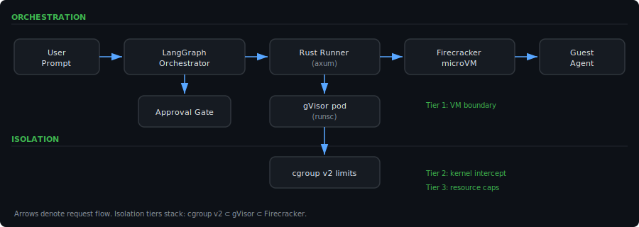
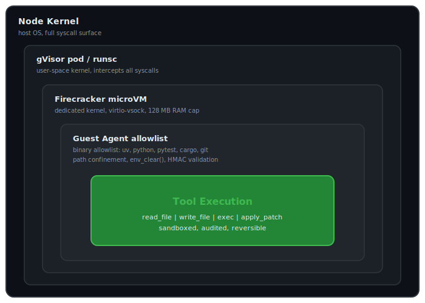
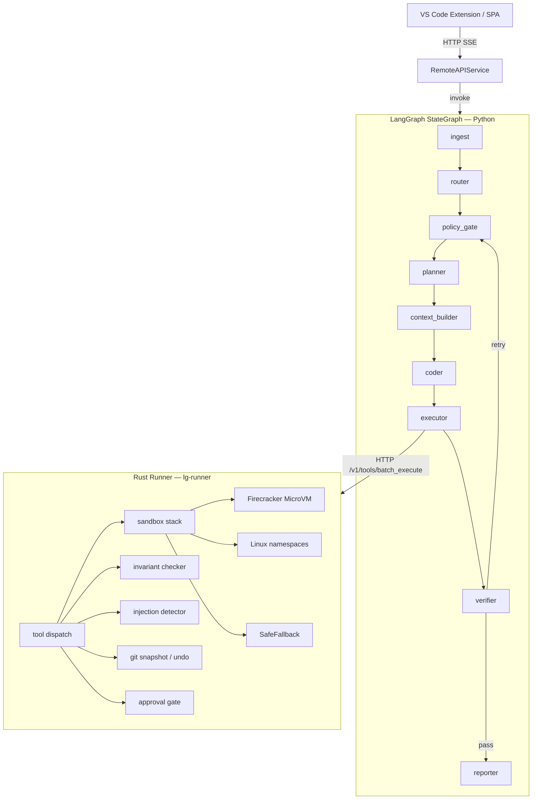

<!-- keywords: agentic coding, LangGraph, Rust, multi-agent, MCP, sandboxed AI, human-in-the-loop, autonomous coding agent, AI code repair, SWE-bench -->

# Lula

**Production-grade multi-agent coding assistant with a sandboxed Rust execution engine**

[](https://github.com/christianmeurer/Lula/actions/workflows/ci.yml)
[](https://www.python.org/downloads/)
[](https://www.rust-lang.org/)
[](https://github.com/langchain-ai/langgraph)
[](LICENSE)
[](https://github.com/christianmeurer/Lula/releases)
[](https://doi.org/10.5281/zenodo.19138036)

---

Lula is a LangGraph-based multi-agent coding orchestrator paired with a native Rust sandbox runner. It differs from Copilot Workspace, OpenHands, and Devin in four concrete ways: a tripartite persistent memory store (semantic/episodic/procedural) that requires no external vector database; a Rust execution engine with Firecracker MicroVM isolation and HMAC-signed approval gates enforced at the tool call level; a dynamic DAG scheduler with cycle-safe runtime rewiring across git-worktree-isolated agents; and a cross-repo SCIP symbol index for multi-repository dependency awareness. It is designed for engineering teams that require autonomous coding pipelines with audit trails, operator approval governance, local or private-cloud deployment, and extensibility through the MCP tool protocol.

---





> Terminal demo: run `vhs scripts/demo.tape` to generate `docs/demo.gif`

---

## 📐 Architecture Overview

The system enforces a strict split between reasoning and execution. The Python LangGraph orchestrator drives the full plan/execute/verify/recover loop and never touches the filesystem or spawns subprocesses directly. All tool calls are dispatched over HTTP to the Rust runner, which enforces path boundaries, command allowlists, sandbox isolation, and approval gates before performing any action.



The orchestrator implements three routing lanes: **interactive** (low-complexity tasks resolved in a single plan/execute/verify cycle), **deep_planning** (multi-step tasks requiring planner decomposition into typed `AgentHandoff` envelopes), and **recovery** (failed verifications re-enter at `policy_gate` with a failure classification and revised handoff). The Rust runner's sandbox stack degrades gracefully: Firecracker MicroVM (full VM isolation via vsock guest agent, Linux-only) → Linux namespaces (user/PID/net/mount isolation, Linux-only) → SafeFallback (process isolation with env stripping and command allowlist, all platforms). The `SandboxPreference::Auto` default selects `LinuxNamespace` on any host where `unshare` is available; `SafeFallback` is only used when neither Firecracker nor `unshare` is present.

The checkpointing subsystem is implemented as a `backends/` subpackage (`py/src/lg_orch/backends/`) with separate modules for SQLite (WAL mode), Redis, and Postgres. Select the backend with `LG_CHECKPOINT_BACKEND=sqlite|redis|postgres`.

---

## ⚖️ Key Differentiators

| Feature | Lula | Copilot Workspace | OpenHands | E2B | Devin |
|---|:---:|:---:|:---:|:---:|:---:|
| Multi-agent DAG with dynamic rewiring | ✓ | ✗ | ✗ | ✗ | ✗ |
| Tripartite persistent memory (no vector DB) | ✓ | ✗ | ✗ | ✗ | ✗ |
| HMAC approval gates in tool protocol | ✓ | ✗ | ✗ | ✗ | ✗ |
| MCP stdio gateway with PII redaction | ✓ | ✗ | ✗ | ✗ | ✗ |
| Cross-repo SCIP symbol index | ✓ | ✗ | ✗ | ✗ | ✗ |
| Rust sandbox with Firecracker vsock agent | ✓ | ✗ | ~ | ~ | ~ |
| Per-node OTel spans + Prometheus | ✓ | ✗ | ✗ | ~ | ✗ |
| Structured eval framework + SWE-bench | ✓ | ✗ | ✓ | ✗ | ~ |
| Open source | ✓ | ✗ | ✓ | ✗ | ✗ |

---

## 🚀 Quickstart

### Prerequisites

- Python 3.12+
- Rust 1.88+ (`rustup`)
- [`uv`](https://github.com/astral-sh/uv) package manager

### Clone and bootstrap

```bash
git clone https://github.com/christianmeurer/Lula.git
cd Lula

# Windows
scripts\bootstrap_local.cmd

# Bash / macOS / Linux
bash scripts/dev.sh
```

### Run the development stack

```bash
# Windows CMD
scripts\dev.cmd

# PowerShell
scripts\dev.ps1

# Bash
bash scripts/dev.sh
```

This starts the Rust runner on `127.0.0.1:8088` and the Python API on `0.0.0.0:8001`. Open `http://localhost:8001` for the SPA run viewer.

### Run a task

```bash
cd py
uv run python -m lg_orch run --task "Add error handling to the calculator" --repo .
```

### Run tests

```bash
# Python
cd py && uv run pytest

# Rust
cd rs && cargo test
```

### Run eval dry-run

```bash
cd eval && uv run python run.py --dry-run
```

---

## 🔧 Configuration

Runtime configuration lives in [`configs/runtime.dev.toml`](configs/runtime.dev.toml), [`configs/runtime.stage.toml`](configs/runtime.stage.toml), and [`configs/runtime.prod.toml`](configs/runtime.prod.toml). Select a profile with `LG_PROFILE=dev|stage|prod`.

Any TOML key can be overridden at runtime via environment variable using the `pydantic-settings` overlay — no config file modification required for Kubernetes Secret injection. Key env vars: `LG_RUNNER_BASE_URL`, `LG_AUTH_MODE`, `LG_AUTH_BEARER_TOKEN`, `LG_AUTH_JWKS_URL`, `LG_AUTH_HMAC_SECRET`, `LG_CHECKPOINT_BACKEND`, `LG_CHECKPOINT_REDIS_URL`, `LG_CHECKPOINT_POSTGRES_DSN`.

| Key | Dev default | Prod default | Description |
|---|---|---|---|
| `[remote_api] auth_mode` | `"off"` | `"bearer"` | API auth mode; set to `"bearer"` with `LG_REMOTE_API_BEARER_TOKEN` in production |
| `[policy] require_approval_for_mutations` | `true` | `true` | Gate all `apply_patch` and mutation `exec` calls behind human approval |
| `[runner] base_url` | `http://127.0.0.1:8088` | `http://127.0.0.1:8088` | Rust runner URL; override with `LG_RUNNER_BASE_URL` |
| `[remote_api] rate_limit_rps` | `0` (disabled) | `60` | Token-bucket rate limit on the remote API |
| `[policy] network_default` | `"deny"` | `"deny"` | Default outbound network policy for tool execution |
| `[mcp] enabled` | `false` | `false` | Enable MCP server discovery; add `[mcp.servers.NAME]` with optional `schema_hash` |
| `[budgets] max_loops` | `3` | `3` | Maximum plan/execute/verify/recover cycles per run |
| `[budgets] max_tool_calls_per_loop` | `12` | `12` | Maximum tool calls per loop iteration |
| `[checkpoint] enabled` | `true` | `true` | LangGraph SQLite checkpoint store for suspend/resume |
| `[vericoding] enabled` | `true` | `true` | Python-side invariant pre-checks before tool dispatch |

---

## 🛡️ Sandbox Stack

All code execution is delegated to the Rust runner (`rs/runner/`), which selects a sandbox tier based on host capabilities:

**Firecracker MicroVM** (`MicroVmEphemeral`) — Full VM isolation. The runner communicates with a `lula-guest-agent` binary running inside the Firecracker rootfs over `AF_VSOCK` (CID 3, port 52525). The guest agent accepts `GuestCommandRequest` JSON and returns `GuestCommandResponse` JSON over the vsock connection. Linux-only; non-Linux hosts receive a graceful `BadRequest` response.

**Firecracker prerequisites:** `rootfs.ext4` (built via `scripts/build_guest_rootfs.sh`) and `vmlinux` (download from [firecracker-microvm/firecracker](https://github.com/firecracker-microvm/firecracker/releases)) must be present at the paths configured by `LG_RUNNER_ROOTFS_IMAGE` (default `artifacts/rootfs.ext4`) and `LG_RUNNER_KERNEL_IMAGE` (default `artifacts/vmlinux`). In Kubernetes, these are mounted from the node at `/opt/lula/` via a `HostPath` volume; see `infra/k8s/runner-deployment.yaml`.

**Linux namespaces** (`LinuxNamespace`) — User/PID/net/mount namespace isolation via `unshare`. No external dependencies beyond a Linux kernel. Medium security tier; suitable for trusted multi-tenant deployments. **This is the default tier on any Linux host where `unshare` is on `PATH`.**

**Safe fallback** (`SafeFallback`) — Process isolation with `env_clear()`, a command allowlist (`uv`, `python`, `pytest`, `ruff`, `mypy`, `cargo`, `git`), and path confinement. Available on all platforms. Used only when neither Firecracker nor `unshare` is available (e.g. macOS or minimal container images).

In Kubernetes, the runner pod additionally runs under `runtimeClassName: gvisor` with `readOnlyRootFilesystem: true`, `allowPrivilegeEscalation: false`, and `capabilities.drop: [ALL]`.

---

## 🔐 Approval Gates

When the executor encounters a mutation tool call (`apply_patch`, state-modifying `exec`), the Rust runner returns `ApprovalRequired (428)`. The orchestrator suspends the run, persists the approval context to the LangGraph checkpoint store, and surfaces the pending operation in the SPA and VS Code extension. Resumption requires a `POST /runs/{id}/approve` request carrying an HMAC-SHA256 token signed with the configured `hmac_secret`, a nonce, and a TTL. The Rust runner validates the token with constant-time comparison (`subtle::ConstantTimeEq`) before executing the operation.

Three approval policy classes are available: `TimedApprovalPolicy` (auto-approve after N seconds if no response), `QuorumApprovalPolicy` (require M of N approvers), and `RoleApprovalPolicy` (require a specific role claim in the JWT).

---

## 📊 Eval Framework

The eval framework (`eval/`) supports structured behavioral regression testing and SWE-bench benchmarking:

- **Task files** (`eval/tasks/*.json`) — define task request, repo fixture, acceptance criteria, and max iterations
- **Golden assertion files** (`eval/golden/*.json`) — define behavioral assertions checked against reporter output
- **`pass@k` scoring** — unbiased estimator with auto-temperature; grouped by task `class` field (repair / analysis / refactor)
- **SWE-bench adapter** — `--swe-bench path/to/instances.jsonl` loads JSONL tasks; `--swe-bench-limit N` caps the run for fast iteration
- **`resolved_rate` metric** — `resolved / total`; nightly CI enforces a minimum threshold of `0.30` on `real_world_repair.json`
- **`--dry-run`** — prints the resolved task list with IDs, requests, and golden file paths without invoking the graph

```bash
# Single task
cd eval && uv run python run.py --task tasks/canary.json

# SWE-bench (first 20 instances)
cd eval && uv run python run.py --swe-bench path/to/swe_bench_lite.jsonl --swe-bench-limit 20

# Dry-run preview
cd eval && uv run python run.py --task tasks/real_world_repair.json --dry-run
```

---

## ☸️ Deployment

### Kubernetes (production)

All manifests are in [`infra/k8s/`](infra/k8s/). GitOps is managed by ArgoCD with semver image tracking and weekend blackout sync windows. The orchestrator pod runs under `runtimeClassName: gvisor` with a hardened security context.

```bash
DO_REGISTRY=your-registry-name bash scripts/do_deploy_k8s.sh
```

Key manifests: [`deployment.yaml`](infra/k8s/deployment.yaml), [`runner-deployment.yaml`](infra/k8s/runner-deployment.yaml), [`hpa.yaml`](infra/k8s/hpa.yaml), [`pdb.yaml`](infra/k8s/pdb.yaml), [`network-policy.yaml`](infra/k8s/network-policy.yaml), [`argocd-app.yaml`](infra/k8s/argocd-app.yaml).

Full guide: [`docs/deployment_digitalocean.md`](docs/deployment_digitalocean.md).

### DigitalOcean App Platform

```bash
DO_REGISTRY=your-registry-name bash scripts/do_deploy.sh
```

App spec: [`infra/do/app.yaml`](infra/do/app.yaml). Required environment variables:

```
LG_PROFILE=prod
MODEL_ACCESS_KEY=<model key>
LG_RUNNER_API_KEY=<runner key>
LG_REMOTE_API_AUTH_MODE=bearer
LG_REMOTE_API_BEARER_TOKEN=<api token>
LG_REMOTE_API_RATE_LIMIT_RPS=60
LG_RUNNER_LINUX_NAMESPACE_ENABLED=1
```

---

## 🔒 Security

- JWT/JWKS dual-mode authentication with background TTL refresh (no stale key window)
- Role-based route policies — `viewer` / `operator` / `admin` claims enforced at the API layer
- HMAC-SHA256 approval tokens with nonce, TTL, and rotation support; constant-time validation in Rust
- Rust runner: multi-layer path confinement, `env_clear()` before all subprocess spawns, prompt injection detection (bidirectional Unicode overrides, RCE shell vectors, cryptomining patterns), command allowlist in a single canonical location (`config.rs`)
- Audit trail written as JSONL with S3/GCS export via `asyncio.to_thread()` (non-blocking)
- Secrets redaction in all structured log records (structlog JSON)
- `cargo deny` supply-chain scanning on every pull request
- Container runs as UID 10001 (non-root); `readOnlyRootFilesystem: true`; `CAP_DROP ALL`; `seccompProfile: RuntimeDefault`

---

## 🧑‍💻 Development

**Python**

```bash
cd py
uv sync --dev
uv run ruff check src tests
uv run ruff format --check src tests
uv run mypy src
uv run pytest
```

**Rust**

```bash
cd rs
cargo clippy --all-targets --all-features -- -D warnings
cargo fmt --check
cargo test --all-features
```

Standards enforced in CI and locally:
- Python: `ruff` lint + format, `mypy --strict`
- Rust: `clippy --pedantic`, `cargo fmt`
- Property-based tests: `proptest` (Rust), `Hypothesis` (Python)
- Supply-chain: `cargo deny check` + `pip-audit` in the `security-audit` CI job

New features must include a `pytest` unit test in [`py/tests/`](py/tests/). Logic involving collections, numeric boundaries, or string parsing should include a `Hypothesis` property-based test. Rust additions involving boundary conditions should include a `proptest` test.

---

## 📚 Documentation

- [`docs/architecture.md`](docs/architecture.md) — subsystem design and module inventory
- [`docs/deployment_digitalocean.md`](docs/deployment_digitalocean.md) — DigitalOcean App Platform and DOKS deployment guide
- [`docs/gitops.md`](docs/gitops.md) — ArgoCD GitOps pipeline details
- [`docs/platform_console.md`](docs/platform_console.md) — REST API reference and console commands
- [`eval/fixtures/README.md`](eval/fixtures/README.md) — eval fixture schema; how to add new benchmarks
- [`eval/golden/README.md`](eval/golden/README.md) — golden assertion schema and pass-rate scoring

---

## Recent Changes (2026-03-20)

- All 12 critical security and correctness defects from the quality audit resolved.
- Sandbox defaults to `LinuxNamespace` isolation when `unshare` is available.
- Checkpointing backends split into `py/src/lg_orch/backends/` subpackage.
- Dependency: `python-jose` → `PyJWT[crypto]`.
- CI: 80% coverage gate; `trivy-action` pinned to SHA.
- See [`ROADMAP.md`](ROADMAP.md) and [`docs/quality_report.md`](docs/quality_report.md) for details.

---

## License

MIT. See [LICENSE](LICENSE).

---

## Attribution

Created and maintained by [Christian Meurer](https://github.com/christianmeurer).

If you use Lula in your research or work, please cite it:

```bibtex
@software{meurer2026lula,
  author = {Meurer, Christian},
  title = {Lula — Production-grade multi-agent coding assistant},
  year = {2026},
  url = {https://github.com/christianmeurer/Lula},
  version = {1.0.0-rc4}
}
```

[](CITATION.cff)
