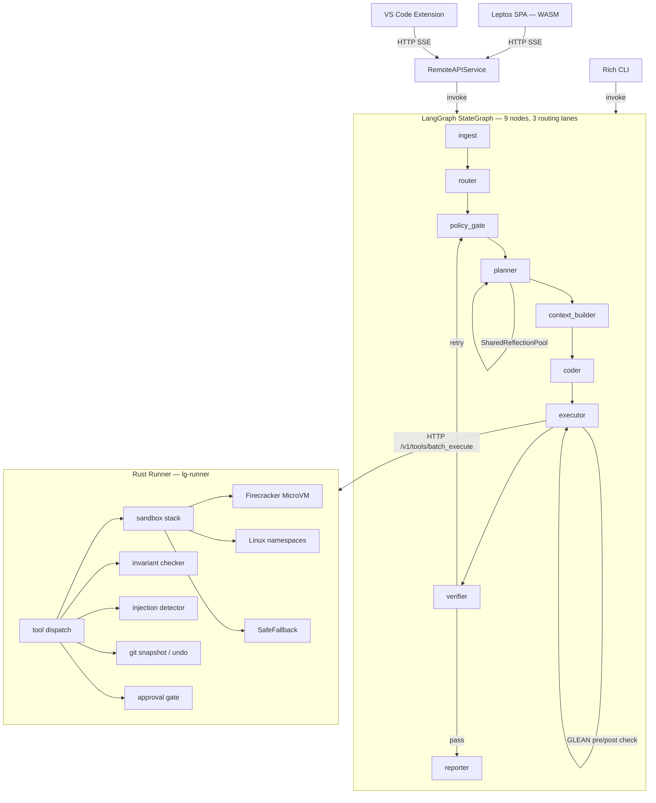

<!-- keywords: agentic coding, LangGraph, Rust, multi-agent, MCP, sandboxed AI, human-in-the-loop, autonomous coding agent, AI code repair, SWE-bench -->

<p align="center">
  
</p>

**Production-grade multi-agent coding assistant with a sandboxed Rust execution engine**

> 1,788 tests | 84% coverage | 7 CI jobs green | v1.2.0 on DOKS

[](https://github.com/christianmeurer/Lula/actions/workflows/ci.yml)
[](https://www.python.org/downloads/)
[](https://www.rust-lang.org/)
[](https://github.com/langchain-ai/langgraph)
[](LICENSE)
[](https://github.com/christianmeurer/Lula/releases)
[](https://doi.org/10.5281/zenodo.19138036)

---

Lula is a LangGraph-based multi-agent coding orchestrator paired with a native Rust sandbox runner. It differs from Copilot Workspace, OpenHands, and Devin in four concrete ways: a tripartite persistent memory store (semantic/episodic/procedural) that requires no external vector database; a Rust execution engine with Firecracker MicroVM isolation and HMAC-signed approval gates enforced at the tool call level; a dynamic DAG scheduler with cycle-safe runtime rewiring across git-worktree-isolated agents; and a cross-repo SCIP symbol index for multi-repository dependency awareness. It is designed for engineering teams that require autonomous coding pipelines with audit trails, operator approval governance, local or private-cloud deployment, and extensibility through the MCP tool protocol.

---


---

## Architecture Overview

The system enforces a strict split between reasoning and execution. The Python LangGraph orchestrator drives the full plan/execute/verify/recover loop and never touches the filesystem or spawns subprocesses directly. All tool calls are dispatched over HTTP to the Rust runner, which enforces path boundaries, command allowlists, sandbox isolation, and approval gates before performing any action.



The orchestrator implements three routing lanes: **interactive** (low-complexity tasks resolved in a single plan/execute/verify cycle), **deep_planning** (multi-step tasks requiring planner decomposition into typed `AgentHandoff` envelopes), and **recovery** (failed verifications re-enter at `policy_gate` with a failure classification and revised handoff). The Rust runner's sandbox stack degrades gracefully: Firecracker MicroVM (full VM isolation via vsock guest agent, Linux-only) → Linux namespaces (user/PID/net/mount isolation, Linux-only) → SafeFallback (process isolation with env stripping and command allowlist, all platforms). The `SandboxPreference::Auto` default selects `LinuxNamespace` on any host where `unshare` is available; `SafeFallback` is only used when neither Firecracker nor `unshare` is present.

The checkpointing subsystem is implemented as a `backends/` subpackage (`py/src/lg_orch/backends/`) with separate modules for SQLite (WAL mode), Redis, and Postgres. Select the backend with `LG_CHECKPOINT_BACKEND=sqlite|redis|postgres`.

---

## Key Differentiators

| Feature | Lula | Copilot Workspace | OpenHands | E2B | Devin |
|---|:---:|:---:|:---:|:---:|:---:|
| Multi-agent DAG with dynamic rewiring | yes | no | no | no | no |
| Tripartite persistent memory (no vector DB) | yes | no | no | no | no |
| sqlite-vec indexed vector search | yes | no | no | no | no |
| pgvector PostgreSQL backend | yes | no | no | no | no |
| GLEAN verification framework | yes | no | no | no | no |
| SharedReflectionPool (cross-iteration learning) | yes | no | no | no | no |
| Temperature diversity mixin | yes | no | no | no | no |
| HMAC approval gates in tool protocol | yes | no | no | no | no |
| MCP stdio gateway with PII redaction | yes | no | no | no | no |
| Cross-repo SCIP symbol index | yes | no | no | no | no |
| Rust sandbox with Firecracker vsock agent | yes | no | partial | partial | partial |
| DiversityRoutingPolicy (heterogeneous models) | yes | no | no | no | no |
| Per-node OTel spans + Prometheus | yes | no | no | partial | no |
| Structured eval framework + SWE-bench | yes | no | yes | no | partial |
| Leptos SPA (Rust/WASM) with dark/light mode | yes | no | no | no | no |
| VS Code extension with approval workflow | yes | no | no | no | no |
| Edge / air-gapped deployment (k3s + Ollama) | yes | no | no | no | no |
| Open source | yes | no | yes | no | no |

---

## Frontend — Leptos SPA

The primary web interface is a Leptos single-page application compiled to WebAssembly (`rs/spa-leptos/`). It follows a **Cyberpunk Minimal** design system — dark backgrounds, neon accent colors, monospace typography, and high-contrast UI elements.

**Key features:**
- **4 pages:** Dashboard, Run Detail, Settings, New Run
- **SSE streaming:** Real-time agent progress via signal-based Server-Sent Events
- **Approval modals:** Inline approve/reject for mutation tool calls with HMAC token flow
- **Diff preview:** Side-by-side patch visualization before approval
- **Dark/light mode toggle:** Persistent theme switching via `localStorage`
- **Resizable split panels:** Drag-handle layout for dashboard and run detail views
- **Keyboard shortcuts:** Ctrl+Enter to submit, Escape to dismiss modals

**Build:**

```bash
cd rs/spa-leptos && trunk serve     # dev server with hot-reload
cd rs/spa-leptos && trunk build --release  # production build
```

Requires [Trunk](https://trunkrs.dev/) and the `wasm32-unknown-unknown` Rust target (`rustup target add wasm32-unknown-unknown`).

### Cyberpunk Minimal Design System

The SPA uses a custom design system with these characteristics:
- **Colors:** Dark slate backgrounds (`#0a0a0f`), neon cyan (`#00ffd5`) and magenta (`#ff00aa`) accents
- **Typography:** Monospace (`JetBrains Mono`, `Fira Code`) for code, system sans-serif for UI
- **Components:** Glowing borders, terminal-style log panels, pulsing status indicators
- **Responsive:** Mobile-first layout with collapsible sidebar navigation

---

## VS Code Extension

The VS Code extension (`vscode-extension/`) provides a native IDE experience for interacting with Lula runs.

**Commands:**
- `lula.runTask` — Start a new agent run from the command palette
- `lula.showRuns` — Open the runs dashboard in a webview panel
- `lula.configure` — Set server URL and auth token (stored in VS Code SecretStorage)
- `lula.approveRun` — Approve a pending mutation from the notification

**Features:**
- **Webview panel:** Live run viewer with SSE streaming, styled to match the Cyberpunk Minimal theme
- **Approval workflow:** Notification-based approve/reject for mutation tool calls
- **Diff preview:** Opens VS Code's native diff editor for patch review
- **SSE proxy:** Extension proxies SSE events from the API to the webview via `postMessage`
- **Code context injection:** Active file and selected text are injected into task submissions automatically
- **Status bar:** Live run status shown in the VS Code status bar

**Build:**

```bash
cd vscode-extension && npm install && node esbuild.js  # development build
cd vscode-extension && npx vsce package                  # produce .vsix
```

The extension is built with esbuild for fast bundling. The CI/CD workflow (`vscode-publish.yml`) automates VSIX building and marketplace publishing on `vscode-v*` tags.

---

## CLI

The CLI (`py/src/lg_orch/commands/`) uses the `rich` library for formatted terminal output — styled panels, tables, progress bars, and colored log streams. Log output goes to stderr; structured results go to stdout, enabling clean piping.

```bash
cd py
uv run python -m lg_orch run --task "Add error handling to the calculator" --repo .
uv run python -m lg_orch serve   # start the API server
uv run python -m lg_orch trace   # inspect OTel traces
uv run python -m lg_orch heal    # trigger healing loop
```

---

## Quickstart

### Prerequisites

- Python 3.12+
- Rust 1.88+ (`rustup`)
- [`uv`](https://github.com/astral-sh/uv) package manager
- [Trunk](https://trunkrs.dev/) (for building the Leptos SPA)
- Node.js 24+ and esbuild (for building the VS Code extension)
- PostgreSQL with pgvector extension — optional; only required if using `LG_CHECKPOINT_BACKEND=postgres` with vector search

### Clone and bootstrap

```bash
git clone https://github.com/christianmeurer/Lula.git
cd Lula

# Windows
scripts\bootstrap_local.cmd

# Bash / macOS / Linux
bash scripts/dev.sh
```

### Run the development stack

```bash
# Windows CMD
scripts\dev.cmd

# PowerShell
scripts\dev.ps1

# Bash
bash scripts/dev.sh
```

This starts the Rust runner on `127.0.0.1:8088` and the Python API on `0.0.0.0:8001`. Open `http://localhost:8001/app/` for the run viewer UI.

### Run a task

```bash
cd py
uv run python -m lg_orch run --task "Add error handling to the calculator" --repo .
```

### Run tests

```bash
# Python
cd py && uv run pytest

# Rust
cd rs && cargo test
```

### Run eval dry-run

```bash
cd eval && uv run python run.py --dry-run
```

---

## Configuration

Runtime configuration lives in [`configs/runtime.dev.toml`](configs/runtime.dev.toml), [`configs/runtime.stage.toml`](configs/runtime.stage.toml), and [`configs/runtime.prod.toml`](configs/runtime.prod.toml). Select a profile with `LG_PROFILE=dev|stage|prod`.

Any TOML key can be overridden at runtime via environment variable using the `pydantic-settings` overlay — no config file modification required for Kubernetes Secret injection. Key env vars: `LG_RUNNER_BASE_URL`, `LG_AUTH_MODE`, `LG_AUTH_BEARER_TOKEN`, `LG_AUTH_JWKS_URL`, `LG_AUTH_HMAC_SECRET`, `LG_CHECKPOINT_BACKEND`, `LG_CHECKPOINT_REDIS_URL`, `LG_CHECKPOINT_POSTGRES_DSN`.

| Key | Dev default | Prod default | Description |
|---|---|---|---|
| `[remote_api] auth_mode` | `"off"` | `"bearer"` | API auth mode; set to `"bearer"` with `LG_REMOTE_API_BEARER_TOKEN` in production |
| `[policy] require_approval_for_mutations` | `true` | `true` | Gate all `apply_patch` and mutation `exec` calls behind human approval |
| `[runner] base_url` | `http://127.0.0.1:8088` | `http://127.0.0.1:8088` | Rust runner URL; override with `LG_RUNNER_BASE_URL` |
| `[remote_api] rate_limit_rps` | `0` (disabled) | `60` | Token-bucket rate limit on the remote API |
| `[policy] network_default` | `"deny"` | `"deny"` | Default outbound network policy for tool execution |
| `[mcp] enabled` | `false` | `false` | Enable MCP server discovery; add `[mcp.servers.NAME]` with optional `schema_hash` |
| `[budgets] max_loops` | `3` | `3` | Maximum plan/execute/verify/recover cycles per run |
| `[budgets] max_tool_calls_per_loop` | `12` | `12` | Maximum tool calls per loop iteration |
| `[checkpoint] enabled` | `true` | `true` | LangGraph SQLite checkpoint store for suspend/resume |
| `[vericoding] enabled` | `true` | `true` | Python-side invariant pre-checks before tool dispatch |

---

## Sandbox Stack

All code execution is delegated to the Rust runner (`rs/runner/`), which selects a sandbox tier based on host capabilities:

**Firecracker MicroVM** (`MicroVmEphemeral`) — Full VM isolation. The runner communicates with a `lula-guest-agent` binary running inside the Firecracker rootfs over `AF_VSOCK` (CID 3, port 52525). The guest agent accepts `GuestCommandRequest` JSON and returns `GuestCommandResponse` JSON over the vsock connection. Linux-only; non-Linux hosts receive a graceful `BadRequest` response.

**Firecracker prerequisites:** `rootfs.ext4` (built via `scripts/build_guest_rootfs.sh`) and `vmlinux` (download from [firecracker-microvm/firecracker](https://github.com/firecracker-microvm/firecracker/releases)) must be present at the paths configured by `LG_RUNNER_ROOTFS_IMAGE` (default `artifacts/rootfs.ext4`) and `LG_RUNNER_KERNEL_IMAGE` (default `artifacts/vmlinux`). In Kubernetes, these are mounted from the node at `/opt/lula/` via a `HostPath` volume; see `infra/k8s/runner-deployment.yaml`.

**Linux namespaces** (`LinuxNamespace`) — User/PID/net/mount namespace isolation via `unshare`. No external dependencies beyond a Linux kernel. Medium security tier; suitable for trusted multi-tenant deployments. **This is the default tier on any Linux host where `unshare` is on `PATH`.**

**Safe fallback** (`SafeFallback`) — Process isolation with `env_clear()`, a command allowlist (`uv`, `python`, `pytest`, `ruff`, `mypy`, `cargo`, `git`), and path confinement. Available on all platforms. Used only when neither Firecracker nor `unshare` is available (e.g. macOS or minimal container images).

In Kubernetes, the runner pod additionally runs under `runtimeClassName: gvisor` with `readOnlyRootFilesystem: true`, `allowPrivilegeEscalation: false`, and `capabilities.drop: [ALL]`.

---

## Approval Gates

When the executor encounters a mutation tool call (`apply_patch`, state-modifying `exec`), the Rust runner returns `ApprovalRequired (428)`. The orchestrator suspends the run, persists the approval context to the LangGraph checkpoint store, and surfaces the pending operation in the SPA and VS Code extension. Resumption requires a `POST /runs/{id}/approve` request carrying an HMAC-SHA256 token signed with the configured `hmac_secret`, a nonce, and a TTL. The Rust runner validates the token with constant-time comparison (`subtle::ConstantTimeEq`) before executing the operation.

Three approval policy classes are available: `TimedApprovalPolicy` (auto-approve after N seconds if no response), `QuorumApprovalPolicy` (require M of N approvers), and `RoleApprovalPolicy` (require a specific role claim in the JWT).

---

## Eval Framework

The eval framework (`eval/`) supports structured behavioral regression testing and SWE-bench benchmarking:

- **Task files** (`eval/tasks/*.json`) — define task request, repo fixture, acceptance criteria, and max iterations
- **Golden assertion files** (`eval/golden/*.json`) — define behavioral assertions checked against reporter output
- **`pass@k` scoring** — unbiased estimator with auto-temperature; grouped by task `class` field (repair / analysis / refactor)
- **SWE-bench adapter** — `--swe-bench path/to/instances.jsonl` loads JSONL tasks; `--swe-bench-limit N` caps the run for fast iteration
- **`resolved_rate` metric** — `resolved / total`; nightly CI enforces a minimum threshold of `0.30` on `real_world_repair.json`
- **`--dry-run`** — prints the resolved task list with IDs, requests, and golden file paths without invoking the graph

```bash
# Single task
cd eval && uv run python run.py --task tasks/canary.json

# SWE-bench (first 20 instances)
cd eval && uv run python run.py --swe-bench path/to/swe_bench_lite.jsonl --swe-bench-limit 20

# Dry-run preview
cd eval && uv run python run.py --task tasks/real_world_repair.json --dry-run
```

---

## Deployment

### Kubernetes (production — DOKS)

The live deployment runs on DOKS cluster `lula-prod` in `nyc3` with nginx ingress, cert-manager, and Let's Encrypt TLS. The Helm chart is published to the DigitalOcean OCI registry.

```bash
# Install / upgrade via OCI Helm chart
helm upgrade --install lula \
  oci://registry.digitalocean.com/lula-orch/lula \
  --version 1.2.0 \
  --namespace lula --create-namespace \
  -f infra/helm/values.prod.yaml

# Or deploy with the DigitalOcean script
DO_REGISTRY=your-registry-name bash scripts/do_deploy_k8s.sh
```

After deployment, verify the cluster is healthy:

```bash
bash scripts/verify-deployment.sh
```

**Current status:**
- Cluster: `lula-prod` (nyc3), 2× `s-2vcpu-4gb` nodes, autoscale to 4
- Image: `registry.digitalocean.com/lula-orch/lula:v1.2.0`
- Helm chart: `oci://registry.digitalocean.com/lula-orch/lula:1.2.0`
- HPA: production-tuned scaling policies; PodDisruptionBudget active

Tier 3 Firecracker is implemented in the runner/guest-agent code paths. Enabling it in production is a deployment concern: schedule the runner onto Firecracker-capable nodes and provide `/opt/lula/rootfs.ext4` plus `/opt/lula/vmlinux`.

Key manifests: [`deployment.yaml`](infra/k8s/deployment.yaml), [`runner-deployment.yaml`](infra/k8s/runner-deployment.yaml), [`hpa.yaml`](infra/k8s/hpa.yaml), [`pdb.yaml`](infra/k8s/pdb.yaml), [`network-policy.yaml`](infra/k8s/network-policy.yaml), [`argocd-app.yaml`](infra/k8s/argocd-app.yaml).

Full guide: [`docs/deployment_digitalocean.md`](docs/deployment_digitalocean.md).

### Edge / Local Deployment

For air-gapped or local use (k3s + Ollama), see [`docs/deployment-edge.md`](docs/deployment-edge.md). The edge profile bundles the orchestrator and runner as a single-node k3s workload with Ollama as a local inference provider — no internet access required after initial image pull.

### DigitalOcean App Platform

```bash
DO_REGISTRY=your-registry-name bash scripts/do_deploy.sh
```

Preferred zero-to-live path:

```bash
DO_REGISTRY=your-registry-name \
DIGITAL_OCEAN_MODEL_ACCESS_KEY=<your-do-gradient-key> \
bash scripts/do_deploy_one_shot.sh
```

App spec: [`infra/do/app.yaml`](infra/do/app.yaml). Required environment variables:

```
LG_PROFILE=prod
MODEL_ACCESS_KEY=<model key>
LG_RUNNER_API_KEY=<runner key>
LG_REMOTE_API_AUTH_MODE=bearer
LG_REMOTE_API_BEARER_TOKEN=<api token>
LG_CHECKPOINT_REDIS_URL=<valkey-uri>
```

If you are using the split production topology, deploy the hardened runner on DOKS with [`scripts/do_deploy_k8s.sh`](scripts/do_deploy_k8s.sh) and point the App Platform service at it with `LG_RUNNER_BASE_URL`.

The production UI entrypoint is:

```bash
https://<app-domain>/app/?access_token=<LG_REMOTE_API_BEARER_TOKEN>
```

---

## Security

- JWT/JWKS dual-mode authentication with background TTL refresh (no stale key window)
- Role-based route policies — `viewer` / `operator` / `admin` claims enforced at the API layer
- HMAC-SHA256 approval tokens with nonce, TTL, and rotation support; constant-time validation in Rust
- Rust runner: multi-layer path confinement, `env_clear()` before all subprocess spawns, prompt injection detection (bidirectional Unicode overrides, RCE shell vectors, cryptomining patterns), command allowlist in a single canonical location (`config.rs`)
- Audit trail written as JSONL with S3/GCS export via `asyncio.to_thread()` (non-blocking)
- Secrets redaction in all structured log records (structlog JSON)
- `cargo deny` supply-chain scanning on every pull request
- Container runs as UID 10001 (non-root); `readOnlyRootFilesystem: true`; `CAP_DROP ALL`; `seccompProfile: RuntimeDefault`

---

## Development

**Python**

```bash
cd py
uv sync --dev
uv run ruff check src tests
uv run ruff format --check src tests
uv run mypy src
uv run pytest
```

**Rust**

```bash
cd rs
cargo clippy --all-targets --all-features -- -D warnings
cargo fmt --check
cargo test --all-features
```

Standards enforced in CI and locally:
- Python: `ruff` lint + format, `mypy --strict`
- Rust: `clippy --pedantic`, `cargo fmt`
- Property-based tests: `proptest` (Rust), `Hypothesis` (Python)
- Supply-chain: `cargo deny check` + `pip-audit` in the `security-audit` CI job
- Coverage gate: 84% enforced in pyproject.toml (`--cov-fail-under=84`)

New features must include a `pytest` unit test in [`py/tests/`](py/tests/). Logic involving collections, numeric boundaries, or string parsing should include a `Hypothesis` property-based test. Rust additions involving boundary conditions should include a `proptest` test.

---

## Documentation

- [`docs/architecture.md`](docs/architecture.md) — subsystem design and module inventory
- [`docs/deployment_digitalocean.md`](docs/deployment_digitalocean.md) — DigitalOcean App Platform and DOKS deployment guide
- [`docs/deployment-edge.md`](docs/deployment-edge.md) — Edge / local air-gapped deployment guide (k3s + Ollama)
- [`docs/gitops.md`](docs/gitops.md) — ArgoCD GitOps pipeline details
- [`docs/platform_console.md`](docs/platform_console.md) — REST API reference and console commands
- [`docs/quality_report.md`](docs/quality_report.md) — Codebase quality audit and component scores
- [`docs/agent_collaboration_2026.md`](docs/agent_collaboration_2026.md) — Multi-agent collaboration design and SOTA 2026 direction
- [`eval/fixtures/README.md`](eval/fixtures/README.md) — eval fixture schema; how to add new benchmarks
- [`eval/golden/README.md`](eval/golden/README.md) — golden assertion schema and pass-rate scoring

---

## Recent Changes

### Wave 18 (2026-04-02)
- **GLEAN wired:** GLEAN verification framework active in executor — pre/post tool checks against `DEFAULT_GUIDELINES`; opt-in via `LG_GLEAN_ENABLED=true`.
- **SharedReflectionPool wired:** Cross-iteration failure learning active in planner via SYMPHONY `SharedReflectionPool`.
- **84% coverage gate:** 1,788 tests, `--cov-fail-under=84` enforced in pyproject.toml and CI.
- **Edge deployment profile:** k3s + Ollama single-node config for air-gapped / local use (`docs/deployment-edge.md`).
- **HPA tuning:** Production-ready horizontal pod autoscaler policies; PodDisruptionBudget active.
- **v1.2.0 release:** Helm chart at `oci://registry.digitalocean.com/lula-orch/lula:1.2.0`.

### Wave 17 (2026-04-02)
- **nginx ingress + cert-manager:** TLS termination via Let's Encrypt on the live DOKS cluster.
- **pgvector backend:** PostgreSQL-backed long-term memory vector search (`backends/pgvector.py`).
- **SharedReflectionPool:** SYMPHONY cross-iteration learning framework implemented (`model_routing.py`).
- **Helm OCI:** Chart published to `oci://registry.digitalocean.com/lula-orch/lula:1.1.0`.

### Wave 16 (2026-04-02)
- **Dark/light mode toggle:** Leptos SPA persistent theme switching.
- **Resizable split panels:** Drag-handle layout on Dashboard and Run Detail pages.
- **Keyboard shortcuts:** Ctrl+Enter to submit, Escape to dismiss modals.
- **Code context injection:** VS Code extension injects active file and selection into task submissions.
- **GLEAN framework:** Guideline-grounded agent action auditing (`glean.py`, 11 tests).
- **Temperature diversity mixin:** Pluralistic alignment via temperature spread across model calls.

### Wave 15 (2026-04-01)
- **Leptos SPA:** New Rust/WASM single-page application with Cyberpunk Minimal design, SSE streaming, approval modals, 4 pages.
- **VS Code Extension:** Full-featured extension with webview, SSE streaming, approval workflow, diff preview, esbuild build.
- **Rich CLI:** `rich` library panels, tables, colored output, stderr log separation.
- **sqlite-vec:** Indexed vector search replacing O(n) numpy cosine scan.
- **DiversityRoutingPolicy wired:** SYMPHONY-inspired heterogeneous model selection active.
- **SBOM generation:** CycloneDX SBOM via `anchore/sbom-action` in the release workflow.
- **VSCE publish workflow:** Automated VS Code extension publishing on `vscode-v*` tags.

See [`ROADMAP.md`](ROADMAP.md) and [`docs/quality_report.md`](docs/quality_report.md) for full details.

---

## License

MIT. See [LICENSE](LICENSE).

---

## Attribution

Created and maintained by [Christian Meurer](https://github.com/christianmeurer).

If you use Lula in your research or work, please cite it:

```bibtex
@software{meurer2026lula,
  author = {Meurer, Christian},
  title = {Lula — Production-grade multi-agent coding assistant},
  year = {2026},
  url = {https://github.com/christianmeurer/Lula},
  version = {1.2.0}
}
```

[](CITATION.cff)
