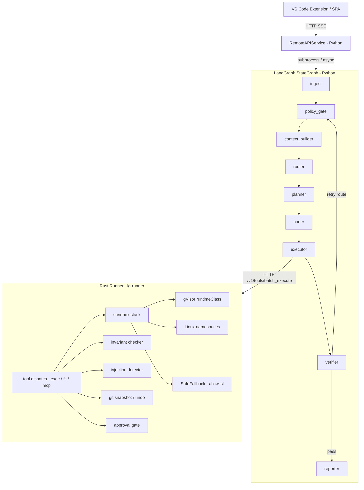

<!-- keywords: agentic coding, LangGraph, Rust, multi-agent, MCP, sandboxed AI, human-in-the-loop, autonomous coding agent, AI code repair, SWE-bench -->

# Lula

> Production-grade agentic coding platform — LangGraph orchestration, Rust sandboxed execution, multi-agent DAG scheduling, full MCP protocol, and human-in-the-loop approval governance.

[](https://github.com/christianmeurer/Lula/actions/workflows/ci.yml)
[](https://www.python.org/downloads/)
[](https://www.rust-lang.org/)
[](LICENSE)
[](https://pypi.org/project/lg-orch/)
[](https://github.com/christianmeurer/Lula/stargazers)

---

**Maturity: Alpha → Beta (v0.7)** — Architecturally ahead of the open-source field in enterprise agentic capabilities; infrastructure hardening in progress.

---

## What It Is

Lula is a production-grade agentic coding platform that pairs a **Python LangGraph orchestrator** with a **Rust execution runtime** to enable secure, governed, and recoverable autonomous software engineering workflows. The platform is designed for AI engineers building autonomous coding pipelines, platform teams that need auditability and operator control over AI-driven mutations, and research teams evaluating agentic systems against real-world repair benchmarks.

The orchestrator is a 9-node LangGraph `StateGraph` DAG — `ingest → policy_gate → context_builder → router → planner → coder → executor → verifier → reporter` — with typed `AgentHandoff` specialist envelopes, multi-class failure taxonomy routing, and Git-snapshot undo atomically linked to LangGraph checkpoint restore. Every mutation to the codebase passes through the Rust runner's three-tier sandboxing stack (gVisor / Linux namespaces / SafeFallback), prompt injection detection, and invariant enforcement before execution. The full MCP 2024-11-05 protocol surface — tools, resources, and prompts — is supported with schema-hash pinning for zero-trust tool integrity.

Persistent memory spans three tiers — semantic (cosine similarity over SQLite), episodic (cross-session recovery facts), and procedural (verified tool sequences) — without requiring an external vector database. Human-in-the-loop approval is governed by multi-path policies: `TimedApprovalPolicy`, `QuorumApprovalPolicy`, and `RoleApprovalPolicy`, with durable audit trails surfaced through the REST API, SSE streaming SPA, and VS Code extension. A MetaGraph multi-agent DAG scheduler with Kahn cycle detection, dynamic rewiring, and git worktree branch isolation per agent enables multi-repo orchestration with SCIP-based cross-repo dependency analysis.

---

## Key Features

- **9-node LangGraph StateGraph DAG** — typed recovery contracts, failure fingerprinting, loop summaries, and acceptance criteria across every plan/execute/verify/recover cycle
- **Rust execution runner with 3-tier sandboxing** — gVisor runtime class (Kubernetes), Linux namespaces (`unshare`), and SafeFallback process isolation; `readOnlyRootFilesystem`, `CAP_DROP ALL`, and network-deny-by-default enforced at the pod level
- **Prompt injection detection and invariant enforcement** — pre-execution scan for bidirectional Unicode overrides, RCE shell vectors, and cryptomining patterns; Python-side and Rust-side invariant checkers mirror each other before any tool call is permitted
- **Full MCP 2024-11-05 protocol** — `tools/list`, `tools/call`, `resources/list`, `resources/read`, `prompts/list`, `prompts/get` with per-server `schema_hash` pinning for zero-trust tool integrity
- **Tripartite persistent memory** — semantic, episodic, and procedural tiers in SQLite with numpy cosine similarity; no external vector database required
- **Multi-path governed approval** — `TimedApprovalPolicy`, `QuorumApprovalPolicy`, and `RoleApprovalPolicy` with durable approval audit trail, checkpoint-based suspend/resume, and approve/reject surfaces in the API, SPA, and VS Code extension
- **Git-snapshot undo atomically linked to LangGraph checkpoints** — every mutation creates a snapshot; undo restores both the filesystem state and the graph checkpoint in a single operation
- **MetaGraph multi-agent DAG scheduler** — Kahn topological sort, cycle detection, dynamic DAG rewiring at runtime, git worktree branch isolation per agent, and concurrency cap enforcement
- **Multi-repo orchestration with SCIP indexing** — `ScipIndex` reads cross-repo symbol definitions; `MultiRepoScheduler` injects dependency-ordered sub-agent handoffs with per-repo runner URLs
- **Typed `AgentHandoff` specialist envelopes** — structured objective, file scope, evidence, constraints, acceptance checks, retry budget, and provenance carried between planner, coder, verifier, and recovery paths
- **SSE streaming SPA and VS Code extension** — D3 v7 force-directed agent graph with node-state animations, SQLite FTS5 full-text run search, inline diffs, verifier report panels, and approval action buttons
- **Eval framework with golden-file assertions** — structural behavioral scoring plus outcome correctness via `post_apply_pytest_pass` assertions; `pass@k` scoring and SWE-bench lite adapter on the roadmap

---

## Architecture Overview

The platform enforces a strict split between reasoning (Python) and execution (Rust). The Python LangGraph orchestrator drives the entire plan/execute/verify/recover loop and never touches the filesystem or spawns subprocesses directly. All tool execution is delegated over HTTP to the Rust runner, which enforces path boundaries, command allowlists, sandbox isolation, and approval gates before performing any action. This boundary is the core security property of the system.



---

## Quick Start

### Prerequisites

- Python 3.12+
- Rust 1.78+ (`rustup`)
- [`uv`](https://github.com/astral-sh/uv) package manager
- Docker (optional, for containerized deployment)

### Bootstrap

```bash
# Clone the repository
git clone https://github.com/christianmeurer/Lula.git
cd Lula

# Windows
scripts\bootstrap_local.cmd

# Bash / macOS / Linux
bash scripts/dev.sh
```

### Run the development stack

```bash
# Windows CMD
scripts\dev.cmd

# PowerShell
scripts\dev.ps1

# Bash
bash scripts/dev.sh
```

This starts the Rust runner on `127.0.0.1:8088` and the Python remote API on `0.0.0.0:8001`. Open `http://localhost:8001` for the SPA run viewer.

### Run a task from the CLI

```bash
cd py
uv run lg-orch run "implement a new helper function" --trace
```

### Run the test suite

```bash
cd py
uv run pytest
```

### Run the eval framework

```bash
python eval/run.py --task eval/tasks/canary.json
```

### Run with a real model

```bash
export MODEL_ACCESS_KEY=your_do_or_openai_key

# Configure provider in configs/runtime.dev.toml under [models.planner]
cd py
uv run lg-orch run "fix the failing test in py/tests/" --trace
```

---

## Configuration

All runtime configuration is in [`configs/runtime.dev.toml`](configs/runtime.dev.toml), [`configs/runtime.stage.toml`](configs/runtime.stage.toml), and [`configs/runtime.prod.toml`](configs/runtime.prod.toml). Select a profile via `LG_PROFILE=dev|stage|prod`.

| Section / Key | Dev default | Prod default | Description |
|---|---|---|---|
| `[remote_api] auth_mode` | `"off"` | `"bearer"` | API authentication mode; set to `"bearer"` with `LG_REMOTE_API_BEARER_TOKEN` in production |
| `[policy] require_approval_for_mutations` | `true` | `true` | Gate all `apply_patch` and state-modifying `exec` calls behind human approval |
| `[runner] base_url` | `http://127.0.0.1:8088` | `http://127.0.0.1:8088` | URL of the Rust runner; override with `LG_RUNNER_BASE_URL` env var |
| `[remote_api] rate_limit_rps` | `0` (disabled) | `60` | Token-bucket rate limit on the remote API; `0` disables limiting |
| `[policy] network_default` | `"deny"` | `"deny"` | Default network policy for tool execution; `"deny"` blocks outbound network unless explicitly permitted |
| `[mcp] enabled` | `false` | `false` | Enable MCP server discovery; add `[mcp.servers.NAME]` entries with optional `schema_hash` for pinning |
| `[budgets] max_loops` | `3` | `3` | Maximum plan/execute/verify/recover cycles per run |
| `[budgets] max_tool_calls_per_loop` | `12` | `12` | Maximum tool calls dispatched per loop iteration |
| `[checkpoint] enabled` | `true` | `true` | Enable LangGraph SQLite checkpoint store for suspend/resume |
| `[vericoding] enabled` | `true` | `true` | Enable Python-side invariant pre-checks before tool dispatch |

---

## Deployment

### Kubernetes (DigitalOcean DOKS or any K8s cluster)

All manifests are in [`infra/k8s/`](infra/k8s/). The runner deployment runs under `runtimeClassName: gvisor` with a hardened `securityContext`:

- `readOnlyRootFilesystem: true`
- `allowPrivilegeEscalation: false`
- `capabilities.drop: [ALL]`
- `seccompProfile: RuntimeDefault`
- `NetworkPolicy` blocking all external egress except DNS and the orchestrator service

```bash
# Deploy to DigitalOcean Kubernetes
DO_REGISTRY=your-registry-name bash scripts/do_deploy_k8s.sh
```

Key manifests: [`infra/k8s/deployment.yaml`](infra/k8s/deployment.yaml), [`infra/k8s/runner-deployment.yaml`](infra/k8s/runner-deployment.yaml), [`infra/k8s/gvisor-runtime-class.yaml`](infra/k8s/gvisor-runtime-class.yaml), [`infra/k8s/network-policy.yaml`](infra/k8s/network-policy.yaml).

### DigitalOcean App Platform

```bash
# Deploy to DigitalOcean App Platform
DO_REGISTRY=your-registry-name bash scripts/do_deploy.sh
```

The App Platform spec is in [`infra/do/app.yaml`](infra/do/app.yaml). Environment variables required for production:

```
LG_PROFILE=prod
MODEL_ACCESS_KEY=<model key>
LG_RUNNER_API_KEY=<runner key>
LG_REMOTE_API_AUTH_MODE=bearer
LG_REMOTE_API_BEARER_TOKEN=<api token>
LG_REMOTE_API_RATE_LIMIT_RPS=60
LG_RUNNER_LINUX_NAMESPACE_ENABLED=1
```

---

## Roadmap

Full technical detail for each wave is in [`docs/sota_2026_plan.md`](docs/sota_2026_plan.md).

| Wave | Description | Status |
|---|---|---|
| 1 | Documentation sync and shipping baseline | ✅ Complete |
| 2 | First usable product surface — SPA, trace dashboard, Mermaid graph export | ✅ Complete |
| 3 | Run API and persistence — SQLite run store, durable run listing, cancellation | ✅ Complete |
| 4 | Provider expansion and routing maturity — DigitalOcean + OpenAI-compatible, lane-aware routing | ✅ Complete |
| 5 | Agent quality — recovery packets, loop summaries, context compression, episodic memory, eval suite | ✅ Complete |
| 6 | Execution quality — concurrent Rust batch fan-out, streaming inference, VS Code extension, repair benchmark | ✅ Complete |
| 7 | SOTA platform UX — SSE streaming SPA, D3 agent graph, FTS5 run search, VS Code premium UX | ✅ Complete |
| 8 | Collaborative agents and governed autonomy — coder node, typed handoffs, approval suspend/resume, MetaGraph scheduler, git worktree isolation, multi-path approval policies | ✅ Complete |
| 9 | Persistent cross-session memory and neurosymbolic verification — tripartite SQLite memory, invariant checker, SCIP cross-repo indexing, self-healing test loop, gVisor/Kata K8s sandboxing | ✅ Complete |
| 10 | Production hardening — OpenTelemetry span propagation Python/Rust, Prometheus metrics, Redis/Postgres checkpoint store, HPA, JWT RBAC, audit log export, SLA-aware routing | 🚧 In Progress |
| 11 | Evaluation correctness — runner execution for existing fixtures, pass@k scoring, SWE-bench lite adapter, correctness eval CI job | 📋 Planned — golden file assertions are documentation only; not enforced at runtime until Wave 11 runner integration is active |
| 12 | Streaming completeness — token-level streaming from all nodes to SSE endpoint, SPA chunk rendering, VS Code chunk rendering | 📋 Planned |
| 13 | Sandbox, tooling, and schema hardening — cgroup v2 resource limits, Firecracker decision, SCIP toolchain script, InferenceClient function calling, schema enforcement at runtime | 📋 Planned — Firecracker integration is scaffolding; SafeFallback/LinuxNamespace currently active |

---

## Technical Debt Backlog

The following items are tracked for resolution in upcoming waves. See [`docs/quality_report.md`](docs/quality_report.md) for full diagnostic detail on each item.

| Priority | Item | File(s) | Target Wave | Description |
|---|---|---|---|---|
| High | Typed graph state migration | [`py/src/lg_orch/graph.py`](py/src/lg_orch/graph.py), [`py/src/lg_orch/state.py`](py/src/lg_orch/state.py) | Wave 14 | Replace `StateGraph(dict)` with `StateGraph(OrchState)` using typed reducers. Pydantic schema currently documents intent but is not enforced at the graph boundary — dict key typos produce silent `None` values. |
| High | Eval golden file enforcement | [`eval/run.py`](eval/run.py) | Wave 14 | `score_task()` does not load golden JSON files. The golden assertion system (`eq`, `lte`, `gte`, `in`, `contains`) is documentation only. Must be enforced in `score_task()` to catch outcome-correctness regressions. |
| High | Automated CI → registry → deploy pipeline | [`.github/workflows/`](.github/workflows/) | Wave 14 | No workflow builds, pushes, or deploys images on CI green. All production deployments are manual `do_deploy.sh` invocations. Requires: Docker build+push job, trivy image scan, manifest SHA-tag update. |
| High | Image digest pinning | [`infra/k8s/deployment.yaml`](infra/k8s/deployment.yaml), [`infra/k8s/runner-deployment.yaml`](infra/k8s/runner-deployment.yaml) | Wave 14 | All manifests use `:latest`. Any registry push silently deploys. Replace with SHA-pinned or semver-tagged image references managed by ArgoCD Image Updater. |
| Medium | `planner.py` decomposition | [`py/src/lg_orch/nodes/planner.py`](py/src/lg_orch/nodes/planner.py) | Wave 15 | 835-line file mixes intent classification, LLM prompt construction, memory ranking, schema validation, and fallback planning. Decompose into: `_prompt_builder.py`, `_memory_scorer.py`, and a thin `planner.py` orchestrator. |
| Medium | Firecracker API integration | [`rs/runner/src/tools/exec.rs`](rs/runner/src/tools/exec.rs), [`rs/runner/src/sandbox.rs`](rs/runner/src/sandbox.rs) | Wave 15 | `MicroVmEphemeral` backend invokes `firecracker` binary via CLI flags, not the Firecracker Unix socket REST API. All deployments silently degrade to `LinuxNamespace`/`SafeFallback`. Requires full Firecracker VMM API integration. |
| Medium | MCP subprocess connection pooling | [`rs/runner/src/tools/mcp.rs`](rs/runner/src/tools/mcp.rs) | Wave 15 | Each MCP call spawns a fresh subprocess and performs a full handshake. For slow-starting MCP servers this is ≥100ms per call. Implement a per-server connection pool with keep-alive. |
| Medium | Secrets management (ESO/SOPS) | [`infra/k8s/`](infra/k8s/), `scripts/argocd_bootstrap.sh` | Wave 15 | Secrets are managed via manual `kubectl edit`. No External Secrets Operator, Vault, or SOPS integration. Prevents GitOps of secret values and creates per-cluster manual drift. |
| Low | `_sla_policy` module-level global refactor | [`py/src/lg_orch/tools/inference_client.py`](py/src/lg_orch/tools/inference_client.py) | Wave 16 | `_sla_policy` is a mutable module-level singleton. Unsafe for multi-tenant deployments and test isolation. Should be passed as a dependency or stored in request context. |
| Low | Healing loop multi-runner support | [`py/src/lg_orch/healing_loop.py`](py/src/lg_orch/healing_loop.py) | Wave 16 | Healing loop hardcodes `python -m pytest`. No support for `cargo test`, `npm test`, `go test`, or other runners. Extend to detect project type and dispatch to the correct runner. |
| Low | ArgoCD image updater + sync windows | [`infra/k8s/argocd-app.yaml`](infra/k8s/argocd-app.yaml) | Wave 16 | Every `main` push deploys immediately. Add ArgoCD Image Updater for automated tag promotion, and sync windows for production change-freeze periods. |
| Low | `DefaultHasher` in indexing | [`rs/runner/src/indexing.rs`](rs/runner/src/indexing.rs) | Wave 16 | `DefaultHasher` used for SQLite path derivation is non-stable across Rust versions. Replace with FNV1a or another fixed-output hash algorithm to prevent index orphaning after compiler upgrades. |

---

## Known Limitations

The following gaps are tracked and scheduled for remediation. They do not affect the correctness of the current orchestration or execution paths but represent engineering debt or documented deviations between specification and runtime behavior.

- **`StateGraph(dict)` — untyped runtime state.** `OrchState` Pydantic schema documents the intended structure but is not enforced at the LangGraph graph boundary. Mutations at graph edges are not validated against the schema. Tracked for resolution in a future wave.
- **JWKS cache has no TTL.** The JWKS key cache in [`auth.py`](py/src/lg_orch/auth.py) does not expire. Key rotation requires a process restart. Tracked for resolution.
- **Eval golden file assertions are documentation only.** `post_apply_pytest_pass` and structural assertions in [`eval/golden/`](eval/golden/) are not executed against runner output until Wave 11 runner integration is active.
- **Firecracker microVM backend is architectural scaffolding.** The [`sandbox.rs`](rs/runner/src/sandbox.rs) Firecracker path is defined but the Firecracker API client is not wired. All environments currently dispatch through LinuxNamespace or SafeFallback isolation.
- **Healing loop supports pytest only.** [`healing_loop.py`](py/src/lg_orch/healing_loop.py) invokes `pytest` directly. Multi-language test runners (Jest, Cargo test, Go test) are not yet supported.

---

## Security Posture

| Layer | Status | Detail |
|---|---|---|
| Rust runner | Hardened | Non-root UID, `readOnlyRootFilesystem`, `CAP_DROP ALL`, `seccompProfile: RuntimeDefault`, gVisor runtimeClass |
| Python orchestrator | Hardening in progress | `securityContext` fixes and `NetworkPolicy` namespace alignment landed in v0.7; OTel and full RBAC in Wave 10 |
| Approval gating | Active | All state-mutating operations require HMAC-SHA256 approval tokens with TTL and rotation support |
| MCP PII redaction | Active | Bidirectional redaction with deterministic reversible tokens; applied on both inbound tool results and outbound tool arguments |
| Exec environment | Active | `env_clear()` called before all subprocess spawns; minimal allowlist re-injected (`PATH`, `HOME`, `TMPDIR`) |

---

## Contributing

Contributions are welcome. The project is in active development and Wave 10 PRs are particularly welcome.

### Fork and branch

```bash
git clone https://github.com/christianmeurer/Lula.git
cd Lula
git checkout -b feature/your-feature-name
```

Branch naming conventions:

- `feature/short-description` — new capabilities
- `fix/short-description` — bug fixes
- `wave-N/short-description` — work targeting a specific roadmap wave (e.g. `wave-10/otel-span-propagation`)

### Python development setup

```bash
cd py
uv sync
uv run pre-commit install   # installs ruff + mypy hooks
```

The following must pass before opening a PR:

```bash
uv run ruff check src tests
uv run ruff format --check src tests
uv run mypy src
uv run pytest
```

### Rust development setup

```bash
cd rs
cargo clippy --all-targets -- -D warnings
cargo fmt --check
cargo test --all-features
```

All Clippy warnings are treated as errors in CI.

### Test requirements

- New features must include a `pytest` unit test in [`py/tests/`](py/tests/).
- Logic involving collections, numeric boundaries, or string parsing should include a `hypothesis` property-based test. See [`py/tests/test_hypothesis.py`](py/tests/test_hypothesis.py) for existing examples.
- Rust additions should include a `proptest` property test where the logic involves boundary conditions.

### Good first contributions

The [`eval/fixtures/`](eval/fixtures/) directory is a great place to start:

- Add a new bug-fix fixture (broken source file + failing test) under `eval/fixtures/your-scenario/` following the pattern in [`eval/fixtures/test-repair/`](eval/fixtures/test-repair/).
- Add a corresponding task definition under [`eval/tasks/`](eval/tasks/) and a golden assertion file under [`eval/golden/`](eval/golden/).
- This kind of contribution directly improves the platform's outcome correctness benchmarking with zero risk to existing behavior.

### Pull request description

Each PR description should include:

1. **Motivation** — what problem does this change solve?
2. **Wave reference** — which roadmap wave does this advance, if any? (e.g. "Part of Wave 10 — OTel span propagation")
3. **Test coverage** — which tests cover the change? New tests added?
4. **Breaking changes** — does this change any public API, config schema, or eval golden file format?

### Issue labels

| Label | Meaning |
|---|---|
| `good first issue` | Self-contained, well-scoped; suitable for first-time contributors |
| `wave-10` | Relates to Wave 10 production hardening work |
| `security` | Security-relevant change; requires extra review |
| `eval` | Relates to the eval framework or benchmark fixtures |
| `dx` | Developer experience improvement |

### Code of conduct

This project follows the contributor covenant. See [CODE_OF_CONDUCT.md](CODE_OF_CONDUCT.md).

---

## Community and Support

- **GitHub Discussions** — use [Discussions](https://github.com/christianmeurer/Lula/discussions) for questions, design proposals, and general Q&A
- **GitHub Issues** — use [Issues](https://github.com/christianmeurer/Lula/issues) to report bugs or request features
- The project is in active development. Wave 10 (production hardening) is the current focus; PRs for OTel instrumentation, JWT RBAC, and Prometheus metrics are welcome now

---

## License

MIT License. See [LICENSE](LICENSE).

---

## Core Documentation

- [`docs/architecture.md`](docs/architecture.md) — subsystem overview and design decisions
- [`docs/sota_2026_plan.md`](docs/sota_2026_plan.md) — full roadmap with gap analysis, wave-by-wave technical specifications, and market parity status
- [`docs/deployment_digitalocean.md`](docs/deployment_digitalocean.md) — DigitalOcean App Platform and DOKS deployment guide
- [`docs/platform_console.md`](docs/platform_console.md) — REST API reference and console commands
- [`docs/langgraph_plan.md`](docs/langgraph_plan.md) — LangGraph graph design notes
- [`eval/fixtures/README.md`](eval/fixtures/README.md) — eval fixture schema and how to add new benchmarks
- [`eval/golden/README.md`](eval/golden/README.md) — golden assertion schema and pass-rate scoring
